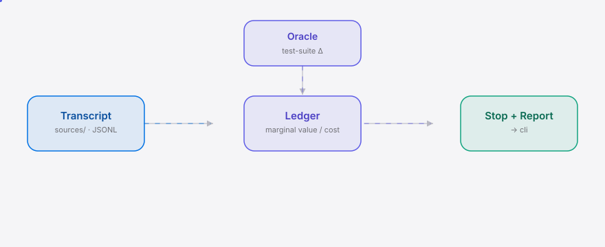

<div align="right"><sub>**English**&nbsp;&nbsp;⇄&nbsp;&nbsp;<a href="./README.md">简体中文</a></sub></div>

<picture>
  <source media="(prefers-color-scheme: dark)" srcset="./assets/hero-dark.svg">
  <source media="(prefers-color-scheme: light)" srcset="./assets/hero-light.svg">
  
</picture>

<p align="center"><sub>Attribrute marginal value to each agent-loop iteration and recommend stopping at diminishing returns — halt at the value knee, not the budget wall.</sub></p>

<p align="center">
  <a href="./LICENSE"></a>
  <a href="https://github.com/SuperMarioYL/margledger/releases"></a>
  <a href="https://github.com/SuperMarioYL/margledger/actions/workflows/ci.yml"></a>
  
  
  
</p>

**In one breath: you run an agentic coding loop, the only termination condition is a hard token-budget cutoff — you burn to the wall and only learn in the post-mortem that the back half added almost no net passing tests. MargLedger turns "was this iteration worth it?" into a grounded algorithmic output and stops the loop where returns flatten.**

<h2> Architecture</h2>

<picture>
  <source media="(prefers-color-scheme: dark)" srcset="./assets/atlas-dark.svg">
  <source media="(prefers-color-scheme: light)" srcset="./assets/atlas-light.svg">
   ledger -> stop/report, with the test-suite oracle feeding marginal value">
</picture>

Data flow: a transcript is normalized by `sources/` into per-iteration records → `ledger.py` attributes marginal value from the test-suite delta → `stop.py` detects the diminishing-returns knee and emits the recommendation, while `report.py` exports Markdown. Value comes from a machine-checkable oracle (the test suite), not a black-box score — this is the precondition that only holds for coding loops where a real ground truth exists.

## Table of contents

- [Why this exists](#why-this-exists)
- [Install](#install)
- [Quickstart](#quickstart)
- [Usage](#usage)
- [Demo](#demo)
- [Configuration](#configuration)
- [Commercial](#commercial)
- [Roadmap](#roadmap)
- [License](#license)

<h2> Why this exists</h2>

Agentic coding loops are missing a flow primitive: a marginal-value ledger computed per iteration. Loop engineering — the discipline that **Addy Osmani** and **Boris Cherny**'s patterns inspired and that [`cobusgreyling/loop-engineering`](https://github.com/cobusgreyling/loop-engineering) shipped as cost tooling (`loop-cost`) in 2026 — already does the cost accounting. But it is cost-only: it cannot see when *value* stops accruing. MargLedger is the value-ledger complement to that lineage — it attributes each iteration's test-suite delta against its marginal token/time cost, surfaces a value/cost curve, and recommends a stop. Stopping moves from gut feel to an auditable, algorithmic verdict.

<h2> Install</h2>

```bash
uv tool install margledger      # or pipx install margledger
```

Dev install:

```bash
git clone https://github.com/SuperMarioYL/margledger
cd margledger && pip install -e ".[dev]"
```

<h2> Quickstart</h2>

```bash
# 1. parse a Claude Code transcript + JUnit oracle -> ledger.json
margledger trace ~/.claude/projects/my-proj --tests junit.xml -o ledger.json

# 2. value/cost curve + stop recommendation
margledger stop ledger.json --hard-budget 10
```

<details><summary>sample output</summary>

```
STOP at iter 4 — marginal_value <= 0.0 for 7 consecutive iters from iter 4;
~50,000 tokens saved vs a 10-iter hard budget.
observed: 10 iters, 104,000 tokens spent, final cumulative value 55 passing tests.
```

</details>

No real transcript handy? Try the shipped synthetic fixture:

```bash
margledger trace tests/fixtures/sample_transcript.jsonl \
  --tests tests/fixtures/sample_junit.xml -o /tmp/ledger.json
margledger stop /tmp/ledger.json --hard-budget 10
```

<h2> Usage</h2>

The five most common workflows:

```bash
# per-iteration ledger (marginal value / marginal tokens / value-per-ktoken)
margledger trace transcript.jsonl --tests junit.xml -o ledger.json

# value/cost curve + knee + stop recommendation (the hero moment)
margledger stop ledger.json --hard-budget 10

# chart only
margledger plot ledger.json

# recommendation only (pipe --json into your pipeline)
margledger recommend ledger.json --hard-budget 10 --json

# shareable Markdown snapshot for the team
margledger replay ledger.json --markdown -o report.md
```

The source is auto-detected: `.jsonl` → Claude Code / generic JSONL; `.vscdb` → Cursor (best-effort, `schema_unverified`). Claude Code JSONL carries no native iteration marker, so iterations are synthesized from the assistant↔user turn sequence; `usage.input_tokens/output_tokens` and `timestamp` are the real, model-attested fields. Cursor `state.vscdb` token fields are a per-file attached-context proxy (not model tokens) and are sparse — honestly flagged `sparse`, never masquerading as the m1/m2 token math.

See `margledger --help` for the full command reference and [`examples/`](./examples/README.md) for more.

<h2> Demo</h2>


The hero moment: a loop that would have burned ~50k tokens for zero net test gain, auto-flagged at iter 4 as the diminishing-returns knee and recommended to stop. Render script: [`docs/demo.tape`](./docs/demo.tape); `.github/workflows/demo.yml` re-renders it on demand.

<h2> Configuration</h2>

The stop rule is a pure function: recommend stop when `marginal_value ≤ ε` for `K` consecutive iterations (default `ε=0`, `K=2`).

| flag | type | default | meaning |
|---|---|---|---|
| `--epsilon` | float | `0.0` | threshold below which an iteration adds "no value" |
| `--k` | int | `2` | consecutive no-value iterations that trigger the stop recommendation |
| `--hard-budget` | int | `None` | hard-budget iteration count (framing only for the "tokens saved" narrative) |
| `--tests` | path | `None` | JUnit XML oracle (final test state, reconciles cumulative value) |
| `--source` | str | `auto` | `auto \| claude_code \| generic \| cursor` |
| `--output` | path | `ledger.json` | ledger output path |

<h2> Commercial</h2>

v0.1 is free OSS CLI (MIT) — the wedge. The commercial read is v0.2: a **self-hostable team dashboard + live stop-webhook** — the dashboard aggregates per-team `ledger.json`, and the stop-webhook auto-halts loops at the value knee.

**Who pays first:** enterprise agent teams on private/local-LLM stacks running DeepSeek-V3 / Qwen2.5-Coder / GLM-4.6 on their own GPUs — every halted loop is saved real GPU hours, so the stop decision is a direct cost lever. Sold as a team plan (≤10 seats + 1 GPU cluster), not per-token.

**Price:** ¥4,800 / team-month (~$660, ≤10 seats + 1 GPU cluster), or ¥48k / year per GPU-cluster node. Grounding: one halted loop saves ~50k tokens ≈ a fraction of a GPU-hour; one team runs hundreds of loops/day.

**Delivery:** self-hosted first (air-gap, data stays on-prem) — Docker image + license key, invoiced bank-transfer (enterprise CN standard); optional Stripe for global teams. Not SaaS — the buyer's hard constraint is data sovereignty.

**First paid target:** 1 enterprise team trial by day 45, 1 signed license by day 90.

The CLI is the deployable wedge now; the team dashboard + live webhook is its commercial read — explicitly out of scope in v0.1 by contract.

### vs `cobusgreyling/loop-engineering`

MargLedger extends the loop-engineering lineage (the cost-only accounting that Addy Osmani and Boris Cherny inspired) into per-iteration value attribution. Honest comparison:

| axis | MargLedger | `loop-engineering` |
|---|:---:|:---:|
| per-iteration token/time cost | ✓ | ✓ |
| per-iteration **value** attribution (test-suite delta) | ✓ | — |
| value/cost curve + stop recommendation | ✓ | — |
| named the discipline + patterns/starters audience | partial | ✓ |
| multi-framework stop-hook protocol (planned) | partial | — |

Where the neighbor wins: `loop-engineering` already owns the audience and the discipline's naming — MargLedger is the value-side complement, not a competitor. The honest risk is that the cost-only leader is one attribution algorithm from closing the gap itself.

<h2> Roadmap</h2>

- [x] **m1 parse + oracle**: Claude Code JSONL transcript + JUnit suite → per-iteration ledger → `ledger.json`
- [x] **m2 stop curve**: value/cost curve + diminishing-returns knee + stop recommendation + tokens-saved; terminal chart
- [x] **m3 Cursor + demo**: best-effort Cursor `state.vscdb` adapter (`schema_unverified`) + the hero stop-moment demo
- [ ] v0.2 self-hostable team dashboard + live stop-webhook (the commercial read of `ledger.json`)
- [ ] secondary oracle: type-check / lint-delta / build-status (for repos without a test suite)
- [ ] cross-framework stop-hook protocol (Cline / Aider / Claude Code)

<h2> License</h2>

MIT — see [`LICENSE`](./LICENSE). Issues and PRs welcome at [`Issues`](https://github.com/SuperMarioYL/margledger/issues).

## Share this

```
MargLedger — the agent-loop ledger that stops iterations at diminishing returns. Extends the loop-engineering lineage (Addy Osmani, Boris Cherny) from cost-only into per-iteration value attribution + a stop recommendation. https://github.com/SuperMarioYL/margledger
```

<p align="center"><sub><a href="./LICENSE">MIT</a> © 2026 SuperMarioYL</sub></p>
