[简体中文](./README.md) · [Website](https://margledger.lei6393.com) · [GitHub](https://github.com/SuperMarioYL/margledger)

<picture>
  <source media="(max-width: 600px) and (prefers-color-scheme: dark)" srcset="./assets/presentation/hero-mobile-dark.svg">
  <source media="(max-width: 600px)" srcset="./assets/presentation/hero-mobile-light.svg">
  <source media="(prefers-color-scheme: dark)" srcset="./assets/presentation/hero-dark.svg">
  
</picture>

# margledger

**See when recorded test progress levels off.**

MargLedger pairs recorded iteration costs with test-pass deltas and produces a post-hoc stop recommendation from an explicit flat-progress rule.

## Why use it

A fixed budget says how much a loop may spend, but it does not show whether observed test progress continues. A ledger makes each iteration’s recorded gain and cost inspectable.

- **Pair progress and cost** — Each row keeps test delta and token cost together.
- **Explicit stop rule** — Epsilon and consecutive-iteration count are inspectable.
- **Retain source qualifications** — Sparse or unverified fields stay labeled.

## Architecture

<picture>
  <source media="(max-width: 600px) and (prefers-color-scheme: dark)" srcset="./assets/presentation/architecture-mobile-dark.svg">
  <source media="(max-width: 600px)" srcset="./assets/presentation/architecture-mobile-light.svg">
  <source media="(prefers-color-scheme: dark)" srcset="./assets/presentation/architecture-dark.svg">
  
</picture>

Source adapters produce RawIteration records. build_ledger computes passing-test deltas and cumulative token cost; an optional final JUnit snapshot reconciles the last value. recommend searches for K consecutive marginal values at or below epsilon and reports the start of that retrospective run.

| Component | Responsibility |
| --- | --- |
| `Transcript adapter` | margledger/sources |
| `Test oracle` | margledger/oracle.py |
| `Iteration ledger` | margledger/ledger.py |
| `Stop recommendation` | margledger/stop.py |

## Install and quickstart

Build with the version declared in the repository manifest. Run the example from the repository root.

```bash
git clone https://github.com/SuperMarioYL/margledger.git
cd margledger
uv venv .venv
uv pip install --python .venv/bin/python -e .
source .venv/bin/activate
```

Four synthetic iterations declare pass counts 1, 3, 3, 3 and a cost of 1100 tokens each. The example builds the ledger and applies K=2.

```bash
.venv/bin/python examples/presentation-demo.py
```

## Recorded demo

<picture>
  <source media="(max-width: 600px) and (prefers-color-scheme: dark)" srcset="./assets/presentation/process-mobile-dark.svg">
  <source media="(max-width: 600px)" srcset="./assets/presentation/process-mobile-light.svg">
  <source media="(prefers-color-scheme: dark)" srcset="./assets/presentation/process-dark.svg">
  
</picture>

The retrospective rule identifies the flat run beginning at iteration 3; no running agent is interrupted.

```text
{
  "marginal_values": [
    1.0,
    2.0,
    0.0,
    0.0
  ],
  "cumulative_tokens": 4400,
  "recommendation": {
    "stop": true,
    "knee_iter": 3,
    "stop_iter": 3,
    "reason": "marginal_value <= 0 for 2 consecutive iters from iter 3",
    "tokens_saved": 1100,
    "hard_budget_iters": null,
    "consecutive_flat": 2,
    "epsilon": 0,
    "k": 2
  }
}
```

The complete command and output are recorded in [docs/demo-results.json](./docs/demo-results.json). Inputs and reproduction code are included in the repository.


The existing recording is retained for context; the text example above documents the reproducible scenario.

## Usage

The CLI exposes the following operations. Commands after the example use your own paths or identifiers.

```bash
margledger trace tests/fixtures/sample_transcript.jsonl --tests tests/fixtures/sample_junit.xml -o ledger.json
margledger recommend ledger.json --epsilon 0 --k 2 --json
margledger replay ledger.json --markdown -o report.md
```

## Configuration

--epsilon and --k control the flat-progress rule; --hard-budget is an iteration-count comparison frame. --source selects auto, claude_code, generic or cursor. Cursor-derived fields can be sparse or schema_unverified and must retain those qualifications.

## Integrations and responsibilities

<picture>
  <source media="(max-width: 600px) and (prefers-color-scheme: dark)" srcset="./assets/presentation/integrations-mobile-dark.svg">
  <source media="(max-width: 600px)" srcset="./assets/presentation/integrations-mobile-light.svg">
  <source media="(prefers-color-scheme: dark)" srcset="./assets/presentation/integrations-dark.svg">
  
</picture>

The following routes are implemented in the source. Choose the input that matches your task and keep the resulting artifact with your project.

| Route | Implemented role |
| --- | --- |
| JSONL transcripts | Recorded iteration inputs |
| JUnit / pytest summaries | Test-count snapshots |
| Ledger JSON | Costs and deltas |
| Markdown / terminal | Post-hoc report |

## Limits and next steps

- The tool analyzes finished data and does not stop an agent automatically.
- Passing-test count is a limited signal; changed or flaky tests can alter it without improving the software. Missing inline test snapshots currently contribute zero recorded gain.
- The reported knee is retrospective and requires later observations. tokens_saved is a counterfactual label over recorded spend, not achieved savings.

Live stop hooks and team dashboards are future work. Better iteration attribution depends on reliable per-iteration test snapshots.

## License and contributions

See [LICENSE](./LICENSE). When reporting an issue, include a minimal input, the command, and the observed output.
